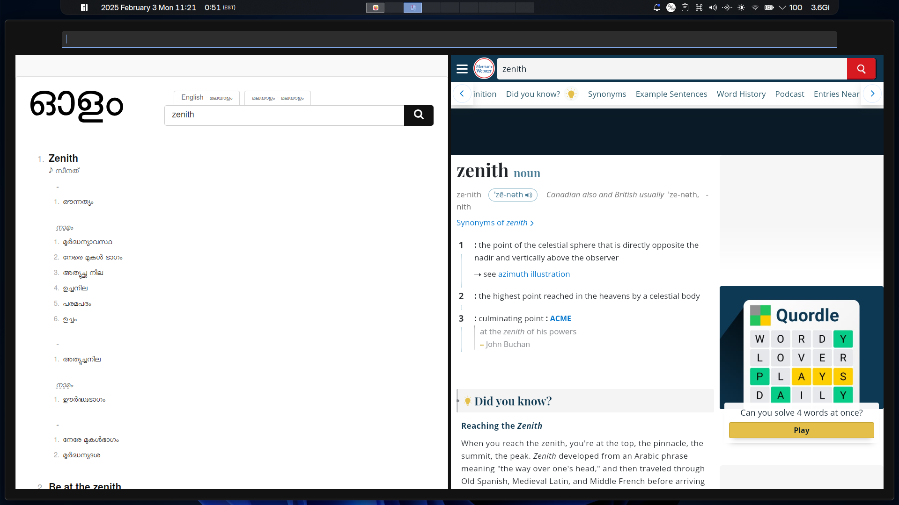

# dict



python script to show olam & mw side by side.  
too lazy to open two tabs.

## "installation"

```
sudo mv dict /usr/bin
```

bruh

## usage

```
dict

dict zenith
```

(i just open through krunner)